[List of Bacis Modules](List_of_Basic_Modules.md)
# CellularAutomata

The CellularAutomata module is a powerful tool when working with raster data. It enables you to create your own cellular automate with your own set of rules and neighbourhoods. Since the works with raster data newly created data are not automatically added to the input data stream. Instead a new data stream is created with the resulting data set is created. If you want to append the new data stream to the existing use:

- AppendViewFromSystem
- JoinDatastreams

Do show the functionality we create a Conway’s Game of Life with DynaMind (download)

Conway’s Game of Life is based on very simple rules. 

- is the current cell alive (value is 1) and has less than 2 alive neighbours (the 8 adjacent cells) the cell dies
- is the current cell alive and has 3 or 4 alive neighbours the cell stays alive
- is the current cell alive and has more than 4 alive neighbours the cell dies
- is the cell is dead and has 3 alive neighbours the cell becomes alive

## Creating a new Raster data set

To set up the simulation first we have to create an initial raster data set with alive and dead cells. When adding a the CellularAutomata module to a simulation it just shows an inport and no outport. This is because per default the CellularAutomate module assumes that we are using information from another raster dataset. The outport is missing because no the name of the output raster data set is yet not defined. 

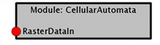

Now double click on the module to set up the parameters. 

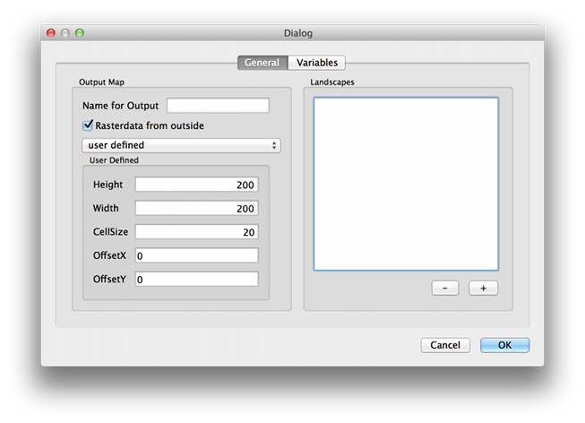

The CellularAutomata dialog box opens as shown in the above figure. First we define the name of the output raster data set. (Name for Output -> “GameOfLife”). Next we deselect the option box Rasterdata from outside. The option box indicates if you want to use raster data from the data stream in the module. This could either be for using the dimensions of an existing raster data field or as  landscapes for setting up the rules (see next step). Your dialog box should now look like the following.

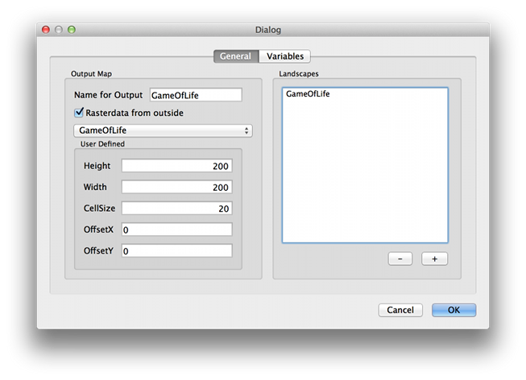

After closing the dialog box the module shows now and outport and no inport. (Maybe a reload of the datastream is required) 

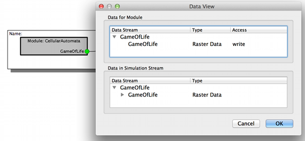

For the first map we just use a simple rule. We want to create an initial seed for the later following cellular automata. To create an alive cells we set the cell to 1. Since we just want a couple alive cells randomly distributed we use following rule. With a probability of 10% the value of a cell is set to 1. 

Now we open the input dialog again and set the rule for our cellular automata. Therefore we switch to the Variables tab.
In the dialog box several rules can be defined that operate on different landscapes (raster data sets). Out of this rules the final decision is composed. Our simple rule is not using any additional informations so we just use Formula to define create the Decision. To do so click on the 3 dots and define following expression:

if(rand(100) < 10, 1,0)

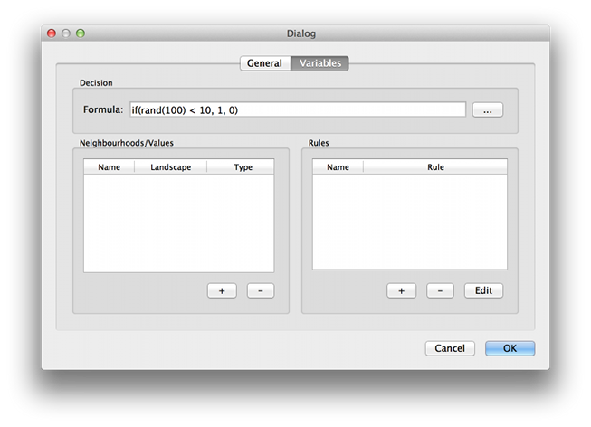

If now a random number between 0 and 99 is smaller than 10 we set the cell to 1 otherwise to 0. Press ok and let the module run. As a result you should get a similar raster data set as shown in the following figure.

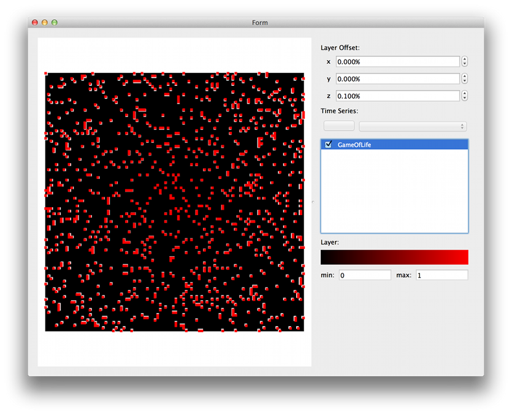

After creating the initial alive cells the next step is to create the Game of Life

## Game Of Life

For the Game of Life we want to repeatedly execute the CellularAutomata module with data from the previous time step. To do so we add a loop group to our simulation. To connect the loopgroup with our the data stream we add a new port. This can be done by double clicking on the loop group and adding a new in port (the name is not important). After adding the port a new inport is shown at the loop group.

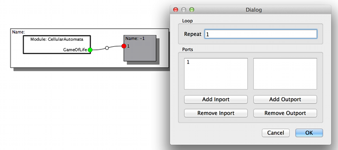

Now change in the new created group (tab loop group in the main window) and add a new CellularAutomata and connect the cellular automata with the data stream before you open the dialog box of the module.

Now we name the resulting raster data set as GameOfLife. It should be the same name as the inport dataset since we are working on the same landscape. It is import to know that in a CellularAutomata simulation the input data set is just used to read informations. To write informations a new data set is created. This means in our simulation we have two GameOfLife data sets, one data set arrives at the inport and is used to read the information and one is used to write the results. The core is taking care of this data management. Next we want to use the dimensions from the input raster data set so we choose GameOfLife in the drop down menu. 

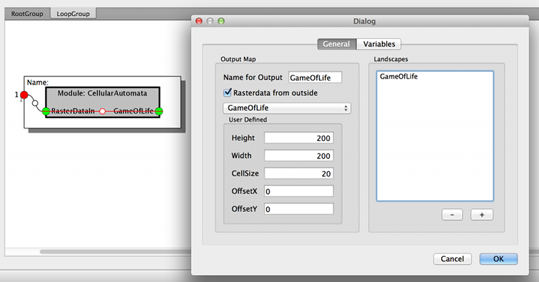

Next we define the landscapes that we want to use in our simulation. In our case we want to know the value of the current cell and the values of the adjacent cells (Moor neighbourhood) of the GameOfLife raster data set. 
Now we can define the rules. For the GameOfLife only two rules are required.

If the current cell is alive and the number of alive adjacent cells is 2 or 3 the cell stays alive, otherwise it dies. 
if the cell is dead and the number of alive adjacent cells is 3 the cell becomes alive otherwise the cell stays dead.

The rules are set up in variables tap. Before defining the rules we define the  variables and neighbourhoods used in the simulation. For our simulation we need 

the current cell; variable name cur
the Moore neighbourhood; variable name moor

To add a neighbourhood/values press the + button. The following dialog box should open. Now we can define e.g. the variable cur, the landscape is GameOfLife and the Neighbourhood is CurrentValue (see figure) and the variable neigh. 

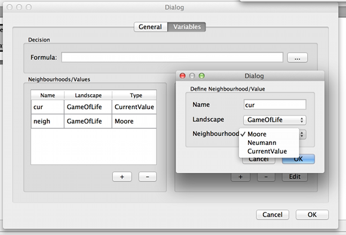

Next we define the rules by pressing the + button in the Rules area and the equation editor should open. We name the rule rule1 and add the expression as shown in the figure. The equation translates to: if the current cell (curr) is alive (==1) then, if the sum of the cells in the neighbourhood is 2 (sum(neigh)) - in this case sum returns the number of alive cells since alive cells are 1 and dead cells 0) or 3, than the cell is alive otherwise the cell is dead.

Rule two is added in a similar way.

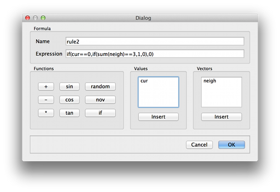

The final decision can now be set to rule1 + rule2 and the final setting of the variables is shown in the next figure.

[[images/cellular_descision.png)

In the final step we now link the outport of the module with the inport and define the link as back link (right click on the link). With a double click on the group box we can now define how often we want to repeat the CellularAutomata.

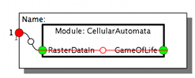

After 100 iterations the result looks like following

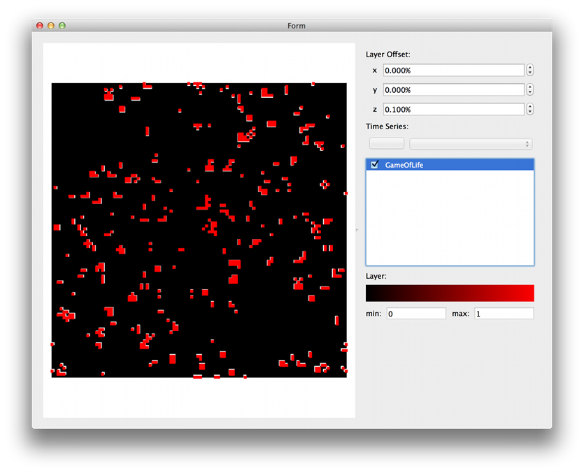

If you want to print the results for every step use the PlotRaster module. We used ffmpeg to create a little animation of 1000 steps.

