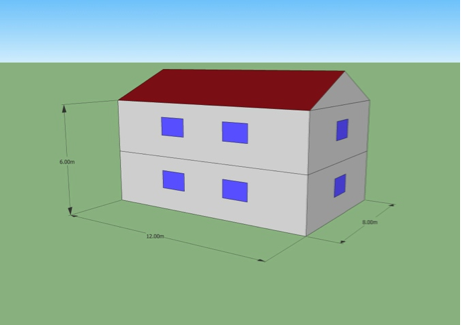
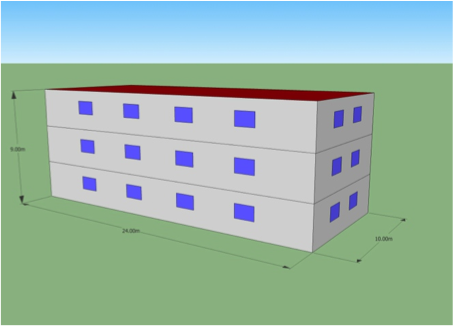

[List of Basic Modules](List_of_Basic_Modules.md)

# CreateHouses

Create houses creates simple buildings single family houses and block buildings as 3D objects containing most common attributes.

##Parameter
|        Name       |          Type          |       Description         | 
|-------------------|------------------------|---------------------------|
| l   | DOUBLE | length in m        |
| b   | DOUBLE | width in m        |
| stories   | INT | stories above ground      |
| alpha   | DOUBLE | roof slope in degree if alpha > 10 a extra roof is created |
| built_year   | INT | construction year of the building, only used if year from city is false |
| year_from_city   | BOOL | use year from CITY |
| T_heating   | DOUBLE | inside temperature when building is heated |
| T_cooling   | DOUBLE | inside temperature when building is cooled |
| onSignal   | BOOL | if true buildings are just placed on parcels where selected > 0|
| l_on_parcel_b   | BOOL | default l building is parallel to l parcel. If false l is parallel to b|
| create3DGeometry   | BOOL | if false only a footprint is created |

##Datastream
|     Identifier    |     Attribute    |      Type             |Access |    Description    |
|-------------------|------------------|-----------------------|-------|-------------------|
| CITY 				|                  | COMPONENT   | read  | only needed if year_from_city is true |
|                   | year  | INT | read | year |
| PARCEL 			|   | FACE   | read  | |
|                   | is_built  | INT | write | set is built to 1 (true) |
|                   | selected  | DOUBLE | read | only needed if onSingal is true |
|                   | BUILDING  | LINK | write |  link to building |
| BUILDING 			|   | COMPONENT   | write  | linked to contains complex geometry |
|                   | type  | STRING | write | "single_family_house" |
|                   | centroid_x  | DOUBLE | write | enter in x in m |
|                   | centroid_y  | DOUBLE | write | enter in y in m |
|                   | built_year  | INT | write | construction year |
|                   | stories  | INT | write | number of stories above ground |
|                   | stories_below  | INT | write | stories below ground |
|                   | stories_height  | INT | write | average story height |
|                   | floor_area  | DOUBLE | write | area of the building footprint in m2 |
|                   | roof_area  | DOUBLE | write | roof area in m2 |
|                   | l_bounding  | DOUBLE | write | length of the minimal bounding box in m |
|                   | b_bounding  | DOUBLE | write | length of the minimal bounding box in m |
|                   | alhpa_bounding  | DOUBLE | write | rotation of the bounding box in degree |
|                   | cellar_used  | INT | write |  true(0), false(1)  |
|                   | roof_used  | INT | write |  true(0), false(1)  |
|                   | T_heating  | DOUBLE | write |  inside temperature when building is heated |
|                   | T_cooling  | DOUBLE | write |  inside temperature when building is cooled |
|                   | V_living  | DOUBLE | write |  volume within the building |
|                   | PARCEL  | LINK | write |  link to parcel |
|                   | Geometry  | LINK | write |  link to geometry |
|                   | Footprint  | LINK | write |  link to footprint |
| Footprint 		|   | FACE   | write  | building footprint |
|                   | built_year  | INT | write | construction year |
|                   | h  | DOUBLE | write | building height |
|                   | BUILDING  | LINK | write | link to building |
| Geometry 			|   | FACE   | write  | building footprint |
|                   | type  | STRING | write | geometry type (window; ceiling; ceiling_roof; wall_outside; roof; roof_wall) |
|                   | color | DOUBLEVECTOR | write | r g b color (as double between 0 and 1)|
|                   | Parent | LINK | write | link to building |

#Detailed Description
CreateHouses creates a simple house placed in the centroid of the parcel and rotated in the direction of the minimal bounding box. To create the building we use a 
rectangular footprint that is extruded according to the number of stories defined. (story height = 3 m). Windows are created with a average distance of 5 m. 1.5 m in height and 1.0 m above floor. If the roof angle is < 10 degree an extra roof is create (see figure)

 