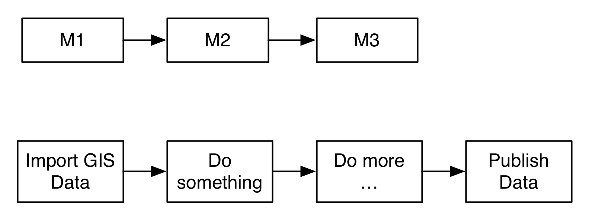

============
Introduction
============

DynaMind is a light weight open source GIS workflow engine (similar to the model builder in ArcGIS). A workflow in DynaMind consists of reusable modules that are connected
 to describe complex processes.

